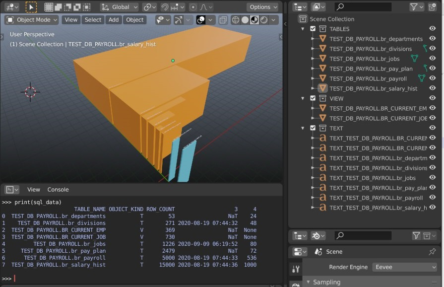
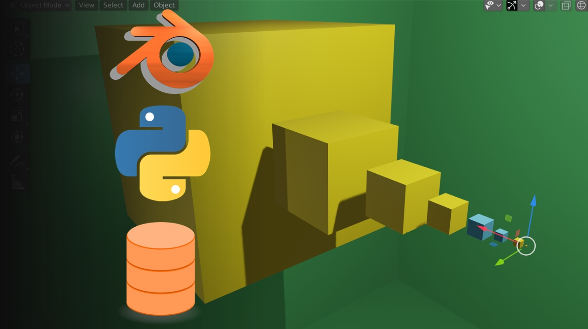
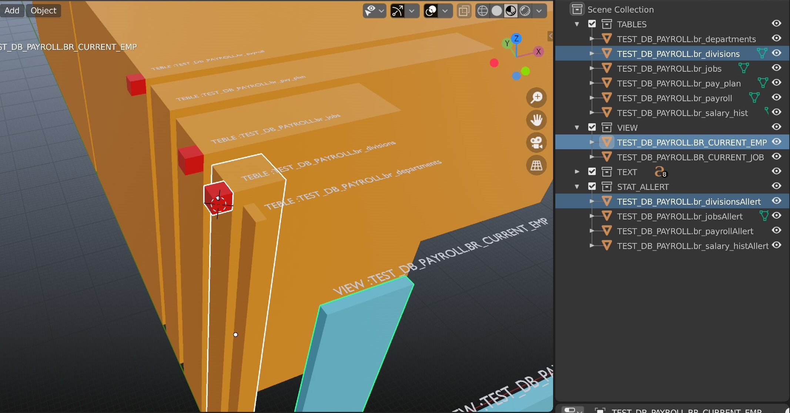

# DWH-Datadisctionary-3D-rapresentation-by Blender and Python
 
This project is related to Data warehousing 3D Data-dictionary visualization, Using Blender, Python, SQL, TeradataExpress ( Vantage) 
My goal is to give to the user a 3D rapresentation of the DWH components and related information as Statistics size and so on in order 
to help to understand better the DWH world.

In the last version you will be able to compare tables by row count and perm space, you will be able to recive an allert (red cube) in case the statistics on a table are not updated since 1 week, distinguish tables and views names.

